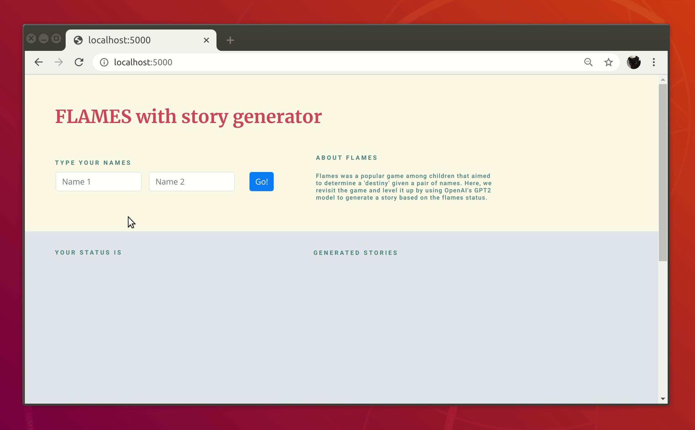

# FLAMES with story generator

Flames was (is?) a popular game among children that aimed to determine a 'destiny' given a pair of names. Here, we revisit the game and level it up by using OpenAI's GPT2 model to generate a story based on the flames status.

